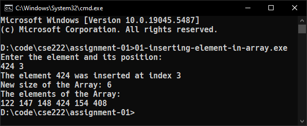
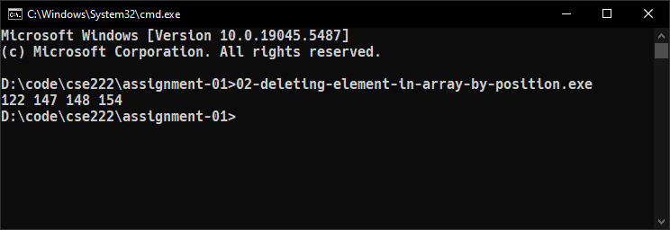
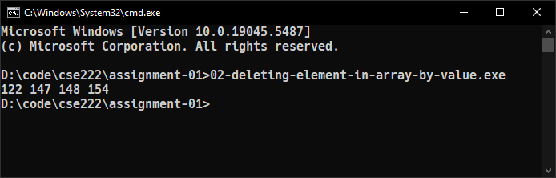
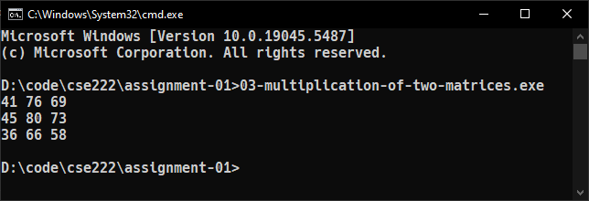
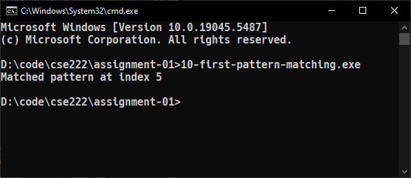
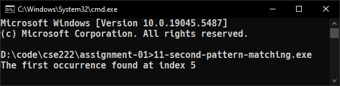

::: {#cover.border}

<section>
	
</section>
<section>
	<p class="h1 w800 underline text-upr">Assignment</p>
	<table class="compact borderless table-large table-upr padless" style="width: 5.1in">
		<tr>
			<th>Course Title</th>
			<th>:</th><td>Data Structure Lab</td>
		</tr>
		<tr>
			<th>Course Code</th>
			<th>:</th><td>CSE 222</td>
		</tr>
		<tr>
			<th>Assignment No.</th>
			<th>:</th><td>01</td>
		</tr>
		<tr>
			<th>Submission Date</th>
			<th>:</th><td>05-03-2025</td>
		</tr>
	</table>
</section>
<section style="--hw: 7.2rem;">
	<p class="h2 w800 text-upr">Submitted To</p>
	<table class="compact borderless table-large table-upr padless withleader">
		<tr>
			<th>Name</th>
			<td>Nasrin Akter</td>
		</tr>
		<tr>
			<th>Dept. of</th>
			<td>Computer Science and Engineering (CSE)</td>
		</tr>
		<tr>
			<th></th>
			<td>Bangladesh University of Business & Technology (BUBT)</td>
		</tr>
	</table>
</section>
<section style="--hw: 7.2rem;">
	<p class="h2 w800 text-upr">Submitted By</p>
	<table class="compact borderless table-large table-upr padless withleader">
		<tr>
			<th>Name</th>
			<td>Shadman Shahriar</td>
		</tr>
		<tr>
			<th>ID No.</th>
			<td>20245103408</td>
		</tr>
		<tr>
			<th>Intake</th>
			<td>53</td>
		</tr>
		<tr>
			<th>Section</th>
			<td>1</td>
		</tr>
		<tr>
			<th>Program</th>
			<td>B.Sc. Engg. in CSE</td>
		</tr>
	</table>
</section>

:::

::: {.centered-heading}

# Data Structure

# Lab Work Assignments

:::

## Array and Matrix

### 1. Write a program to insert an element at a specific position in a given array.

**Ans.** Here is a C++ program that inserts an element at a specific position in a given array:

```CPP
/**
 * ======================
 * Name: Shadman Shahriar
 * ID  : 20245103408
 * ======================
 */

#include <iostream>
using namespace std;

int main()
{
	int array[100] = {122, 147, 148, 154, 408};
	int count = 5;

	int elm, pos;
	cout << "Enter the element and its position: " << endl;
	cin >> elm >> pos;

	if (pos > count)
		pos = count;

	for (int i = count - 1; i >= pos; i--)
		array[i + 1] = array[i];

	array[pos] = elm;
	count++;

	cout << "The element " << elm << " was inserted at index " << pos << endl;
	cout << "New size of the Array: " << count << endl;
	cout << "The elements of the Array:" << endl;

	for (int i = 0; i < count; i++)
	{
		cout << array[i];
		if (i != count - 1)
			cout << " ";
	}
	return 0;
}
```

Here, the code takes a number and its position as input and then attempts to insert it into the array. If the position of the number is greater than the number of elements in the array (when `pos > count`), the number is inserted at the end of the array.

**Output:** The code yields the following output in the terminal:

```diff
+ Enter the element and its position: 424 3
  The element 424 was inserted at index 3
  New size of the Array: 6
  The elements of the Array:
  122 147 148 424 154 408
```



### 2. Write a program to delete an element from an array by value and by position.

**Ans.** Here is a C++ program that deletes an element from an array by its position.

```CPP
/**
 * ======================
 * Name: Shadman Shahriar
 * ID  : 20245103408
 * ======================
 */

#include <iostream>
using namespace std;

int main()
{
	int array[] = {122, 147, 148, 408, 154};
	int loc = 3;

	int count = sizeof(array) / sizeof(array[0]);

	for (int j = loc; j < count - 1; j++)
		array[j] = array[j + 1];
	count--;

	for (int i = 0; i < count; i++)
	{
		cout << array[i];
		if (i != count - 1)
			cout << " ";
	}
	return 0;
}
```

**Output:** The code yields the following output in the terminal:

```diff
122 147 148 154
```



Here's a C++ program that deletes an element from a given array by its value:

```CPP
/**
 * ======================
 * Name: Shadman Shahriar
 * ID  : 20245103408
 * ======================
 */

#include <iostream>
using namespace std;

int main()
{
	int array[] = {122, 147, 148, 408, 154};
	int target = 408;

	int count = sizeof(array) / sizeof(array[0]);

	int i = -1;
	while (array[++i] != target)
		if (i > count)
		{
			i = -1;
			break;
		}

	if (i == -1)
	{
		cout << "Unable to find the target element: " << target << endl;
		return 0;
	}

	for (int j = i; j < count - 1; j++)
		array[j] = array[j + 1];
	count--;

	for (int i = 0; i < count; i++)
	{
		cout << array[i];
		if (i != count - 1)
			cout << " ";
	}

	return 0;
}
```

In this case, the program looks for the index of the target number (e.g. **408**) in the array. If the target number exists, it shifts the remaining numbers to the left and decrements the array size by 1. If the target number does not exists the index (`i`) becomes `-1` and the program exists by printing "Unable to find the target element: 408"

**Output:** The code yields the following output in the terminal:

```diff
122 147 148 154
```



### 3. Implement a program to multiply two matrices and display the result.

**Ans.** Here is a implementation of a C++ program that multiplies two matrices and displays the result.

```CPP
/**
 * ======================
 * Name: Shadman Shahriar
 * ID  : 20245103408
 * ======================
 */

#include <iostream>
#define m 3
using namespace std;

void multiplyMatrices(int A[m][m], int B[m][m], int C[m][m])
{
	for (int i = 0; i < m; i++)
		for (int j = 0; j < m; j++)
		{
			C[i][j] = 0;
			for (int k = 0; k < m; k++)
				C[i][j] += A[i][k] * B[k][j];
		}
}

void displayMatrix(int A[m][m])
{
	for (int i = 0; i < m; i++)
	{
		for (int j = 0; j < m; j++)
			cout << A[i][j] << " ";
		cout << endl;
	}
}

int main()
{
	int A[m][m] = {{5, 7, 7}, {6, 7, 7}, {5, 4, 6}};
	int B[m][m] = {{4, 4, 4}, {1, 1, 2}, {2, 7, 5}};
	int C[m][m];

	multiplyMatrices(A, B, C);
	displayMatrix(C);
	return 0;
}
```

**Output:** The code yields the following output in the terminal:

```diff
41 76 69
45 80 73
36 66 58
```



## Search Algorithm

### 4. Write a program to implement **Binary Search** and explain its best-case and worst-case complexity.

**Ans.** Here is a C program that implements the Binary Search alogirthm:

```C
/**
 * ======================
 * Name: Shadman Shahriar
 * ID  : 20245103408
 * ======================
 */

#include <stdio.h>

int binarySearch(int array[], int data, int n)
{
	int l = 0, r = n - 1, mid;
	while (l < r)
	{
		mid = (l + r) / 2;
		if (array[mid] == data)
			return mid;
		else if (array[mid] < data)
			l = mid - 1;
		else
			r = mid + 1;
	}
	return -1;
}

int main()
{
	int array[] = {5, 10, 15, 16, 18, 32, 37, 44};
	int n = sizeof(array) / sizeof(array[0]);

	int data = 18;
	int result = binarySearch(array, data, n);

	if (result == -1)
		printf("NOT found");
	else
		printf("%d found at index %d", data, result);
	return 0;
}
```

**Complexity:** The time complexity of the Binary Search algorithm is `O(log n)`.

The best case is when the element is at the middle index of the array. It takes only one comparison to find the target element. So the best case complexity is `O(1)`.

The worst case will be when the element is present in the first position. As seen in the average case, the comparison required to reach the first element is `log n`. So the time complexity for the worst case is `O(log n)`.

| Best Case | Worst Case |
| --------- | ---------- |
| `O(1)`    | `O(log n)` |

Space complexity is `O(1)` as it uses a constant amount of extra space.

**Output:** The code yields the following output in the terminal:

```diff
18 found at index 4
```

## Sorting Algorithm

### 5. Write a program to implement **Bubble Sort**, count the number of swaps, and explain its best-case and worst-case complexity.

**Ans.** Here is a C++ implementation of Bubble Sort:

```CPP
/**
 * ======================
 * Name: Shadman Shahriar
 * ID  : 20245103408
 * ======================
 */

#include <iostream>
using namespace std;

void bubbleSort(int array[], int n)
{
	for (int pass = 0; pass < n - 1; pass++)
		for (int i = 0; i < n - pass - 1; i++)
			if (array[i] > array[i + 1])
			{
				int temp = array[i];
				array[i] = array[i + 1];
				array[i + 1] = temp;
			}
}

void display(int array[], int n)
{
	for (int i = 0; i < n; i++)
	{
		cout << array[i];
		if (i != n - 1)
			cout << ", ";
	}
}

int main()
{
	int array[5] = {0};
	int n = sizeof(array) / sizeof(array[0]);
	for (int i = 0; i < n; i++)
		cin >> array[i];

	cout << "Array : ";
	display(array, n);
	bubbleSort(array, n);

	cout << "\nSorted: ";
	display(array, n);
	return 0;
}
```

**Number of Operations:**

| Key Comparisons     | Item Assignments (Swaps) |
| ------------------- | ------------------------ |
| `(n * (n - 1)) / 2` | `3 * (n - 1)`            |

**Complexity:** The time complexity of Bubble Sort is `O(n^2)`.

The best case occurs when the array is already sorted. So, the number of comparisons required is N-1 and the number of swaps required = 0. In the best case, time complexity is `O(n)`.

The worst-case condition for bubble sort occurs when elements of the array are arranged in decreasing order. In the worst case, the total number of iterations or passes required to sort a given array is `(n - 1)`. where `n` is the number of elements present in the array.

| Best Case | Average Case | Worst Case |
| --------- | ------------ | ---------- |
| `O(n)`    | `O(n^2)`     | `O(n^2)`   |

The space complexity of Bubble Sort is `O(1)` since it only needs a constant amount of additional space during the sorting process.

**Output:** The code yields the following output in the terminal:

```diff
+ 154 147 122 148 408
  Array : 154, 147, 122, 148, 408
  Sorted: 122, 147, 148, 154, 408
```

### 6. Write a program to implement **Selection Sort** and explain its best-case and worst-case complexity.

**Ans.** Here is a C++ implementation of Selection Sort:

```CPP
/**
 * ======================
 * Name: Shadman Shahriar
 * ID  : 20245103408
 * ======================
 */

#include <iostream>
using namespace std;

void selectionSort(int array[], int n, bool ascending)
{
	for (int i = 0; i < n - 1; i++)
	{
		int min = i;
		for (int j = i + 1; j < n; j++)
			if (array[min] > array[j] && ascending || array[min] < array[j] && !ascending)
				min = j;
		int temp = array[i];
		array[i] = array[min];
		array[min] = temp;
	}
}

void display(int array[], int n)
{
	for (int i = 0; i < n; i++)
	{
		cout << array[i];
		if (i != n - 1)
			cout << ", ";
	}
}

int main()
{
	int array[5] = {0};
	int n = sizeof(array) / sizeof(array[0]);
	for (int i = 0; i < n; i++)
		cin >> array[i];

	cout << "Array : ";
	display(array, n);
	selectionSort(array, n, true);

	cout << "\nSorted: ";
	display(array, n);
	return 0;
}
```

**Complexity:** The time complexity of Selection Sort is `O(n^2)` in all cases (**best**, **average**, and **worst**). It does **NOT** depend on the initial order of elements, providing predictable performance.

| Best Case | Average Case | Worst Case |
| --------- | ------------ | ---------- |
| `O(n^2)`  | `O(n^2)`     | `O(n^2)`   |

Selection sort is an in-place sorting algorithm with a space complexity of `O(1)`.

**Output:** The code yields the following output in the terminal:

```diff
+ 148 154 147 122 408
  Array : 148, 154, 147, 122, 408
  Sorted: 122, 147, 148, 154, 408
```

### 7. Write a program to implement **Insertion Sort** and explain its best-case and worst-case complexity.

**Ans.** Here is a C++ implementation of Insertion Sort:

```CPP
/**
 * ======================
 * Name: Shadman Shahriar
 * ID  : 20245103408
 * ======================
 */

#include <iostream>
using namespace std;

void insertionSort(int array[], int n)
{
	for (int i = 1; i < n; i++)
	{
		int temp = array[i], j = i - 1;
		while (j >= 0 && array[j] > temp)
		{
			array[j + 1] = array[j];
			j--;
		}
		array[j + 1] = temp;
	}
}

void display(int array[], int n)
{
	for (int i = 0; i < n; i++)
	{
		cout << array[i];
		if (i != n - 1)
			cout << ", ";
	}
}

int main()
{
	int array[5] = {0};
	int n = sizeof(array) / sizeof(array[0]);
	for (int i = 0; i < n; i++)
		cin >> array[i];

	cout << "Array : ";
	display(array, n);
	insertionSort(array, n);

	cout << "\nSorted: ";
	display(array, n);
	return 0;
}
```

**Complexity:** The best-case time complexity of Insertion Sort occurs when the input array is already sorted. In this scenario, each element is compared with its preceding elements until no swaps are needed, resulting in a linear time complexity. Therefore, the best-case time complexity is `O(n)`.

The worst-case time complexity of Insertion Sort occurs when the input array is in reverse sorted order. In this scenario, each element needs to be compared and possibly swapped with every preceding element, resulting in a quadratic time complexity. Therefore, the worst-case time complexity is `O(n^2)`.

| Best Case | Average Case | Worst Case |
| --------- | ------------ | ---------- |
| `O(n)`    | `O(n^2)`     | `O(n^2)`   |

Insertion sort is a stable sort with a space complexity of `O(1)`.

**Output:** The code yields the following output in the terminal:

```diff
+ 148 154 147 122 408
  Array : 148, 154, 147, 122, 408
  Sorted: 122, 147, 148, 154, 408
```

### 8. Write a program to implement **Quick Sort** and display the partitioning process.

**Ans.** Here is a C++ implementation of Quick Sort:

```CPP
/**
 * ======================
 * Name: Shadman Shahriar
 * ID  : 20245103408
 * ======================
 */

#include <iostream>
using namespace std;

int partition(int a[], int l, int h)
{
	int pivot = a[l];
	int i = l;
	int j = h;

	while (i < j)
	{
		while (a[i] <= pivot)
			i++;
		while (a[j] > pivot)
			j--;
		if (i < j)
			swap(a[i], a[j]);
	}
	swap(a[l], a[j]);
	return j;
}

void quickSort(int a[], int l, int h)
{
	if (l < h)
	{
		int location = partition(a, l, h);
		quickSort(a, l, location - 1);
		quickSort(a, location + 1, h);
	}
}

void display(int array[], int n)
{
	for (int i = 0; i < n; i++)
	{
		cout << array[i];
		if (i != n - 1)
			cout << ", ";
	}
}

int main()
{
	int a[] = {33, 1, 0, 76, 2};
	int n = sizeof(a) / sizeof(a[0]);
	quickSort(a, 0, n - 1);
	display(a, n);
	return 0;
}
```

**Partitioning Process:** QuickSort works on the principle of divide and conquer. The algorithm selects an element from the array as the pivot. Then it rearranges the array around the pivot. After partitioning, all elements smaller than the pivot will be on its left, and all elements greater than the pivot will be on its right.

**Output:** The code yields the following output in the terminal:

```diff
0, 1, 2, 33, 76
```

### 9. Write a program to implement **Radix Sort**.

**Ans.** Here is a C++ implementation of Radix Sort:

```CPP
/**
 * ======================
 * Name: Shadman Shahriar
 * ID  : 20245103408
 * ======================
 */

#include <iostream>
using namespace std;

int getLargest(int array[], int n)
{
	int max = array[0];
	for (int i = 1; i < n; i++)
		if (array[i] > max)
			max = array[i];
	return max;
}

void countingSort(int array[], int n, int place)
{
	const int max = 10;
	int output[n];
	int count[max];

	for (int i = 0; i < max; ++i)
		count[i] = 0;
	for (int i = 0; i < n; i++)
		count[(array[i] / place) % 10]++;
	for (int i = 1; i < max; i++)
		count[i] += count[i - 1];

	for (int i = n - 1; i >= 0; i--)
	{
		output[count[(array[i] / place) % 10] - 1] = array[i];
		count[(array[i] / place) % 10]--;
	}
	for (int i = 0; i < n; i++)
		array[i] = output[i];
}

void radixSort(int array[], int n)
{
	int max = getLargest(array, n);
	for (int place = 1; max / place > 0; place *= 10)
		countingSort(array, n, place);
}

void display(int array[], int n)
{
	for (int i = 0; i < n; i++)
	{
		cout << array[i];
		if (i != n - 1)
			cout << ", ";
	}
}

int main()
{
	int array[] = {148, 147, 154, 384, 122, 408, 1, 34, 91, 3, 4, 12};
	int n = sizeof(array) / sizeof(array[0]);
	radixSort(array, n);
	display(array, n);
	return 0;
}
```

**Output:** The code yields the following output in the terminal:

```diff
1, 3, 4, 12, 34, 91, 122, 147, 148, 154, 384, 408
```

## Pattern Matching

### 10. First Pattern Matching

Given two strings `P` (**Pattern**) and `T` (**Text**), implement `first pattern matching` algorithm to find the starting index of the first occurrence of `P` in `T`. If `P` is not found in `T`, return `0`.

**Ans.** Here is a C++ program that satisfies the given conditions:

```CPP
/**
 * ======================
 * Name: Shadman Shahriar
 * ID  : 20245103408
 * ======================
 */

#include <iostream>
using namespace std;

int main()
{
	string T = "voicenotereceived";
	string P = "note";
	int l_T = T.length();
	int l_P = P.length();
	int max_substr = l_T - l_P + 1;
	int found = -1;

	int j;
	for (int i = 0; i < max_substr; i++)
	{
		for (j = 0; j < l_P; j++)
			if (T[i + j] != P[j])
				break;

		if (j == l_P)
		{
			found = i;
			break;
		}
	}

	if (found != -1)
		cout << "Matched pattern at index " << found << endl;
	return 0;
}
```

**Output:** The code yields the following output in the terminal:

```diff
Matched pattern at index 5
```



### 11. Second Pattern Matching

Given a pattern `P` and a text `T` of length `N`, implement a `second pattern matching` algorithm to find the first occurrence of `P` in `T`. The algorithm should utilize a **pattern matching table** to efficiently search for the pattern.

**Ans.** Here is a C program that satisfies the given conditions:

```C
/**
 * ======================
 * Name: Shadman Shahriar
 * ID  : 20245103408
 * ======================
 */

#include <stdio.h>
#include <string.h>
#define d 256
#define q 101

int main()
{
	char text[] = "voicetextreceived";
	char pattern[] = "text";
	int len_P = strlen(pattern);
	int len_T = strlen(text);

	int i, j;
	int val_P = 0;
	int current_T = 0;
	int calcuP = 1;

	for (i = 0; i < len_P - 1; i++)
		calcuP = (calcuP * d) % q;

	for (i = 0; i < len_P; i++)
	{
		val_P = (d * val_P + pattern[i]) % q;
		current_T = (d * current_T + text[i]) % q;
	}

	for (i = 0; i <= len_T - len_P; i++)
	{
		if (val_P == current_T)
		{
			for (j = 0; j < len_P; j++)
			{
				if (text[i + j] != pattern[j])
					break;
			}
			if (j == len_P)
				printf("The first occurrence found at index %d\n", i);
		}

		if (i < len_T - len_P)
		{
			current_T = (d * (current_T - text[i] * calcuP) + text[i + len_P]) % q;
			if (current_T < 0)
				current_T = (current_T + q);
		}
	}
	return 0;
}
```

**Output:** The code yields the following output in the terminal:

```diff
The first occurrence found at index 5
```


