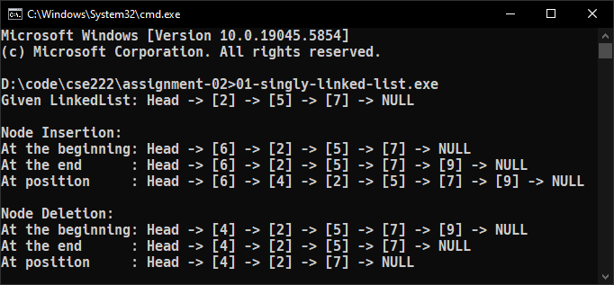
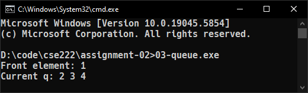
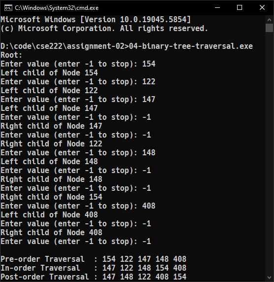
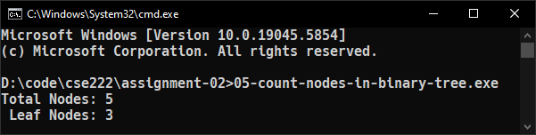
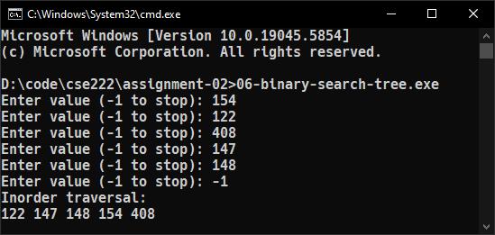
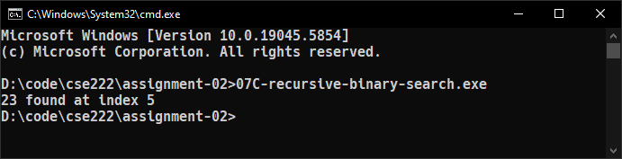
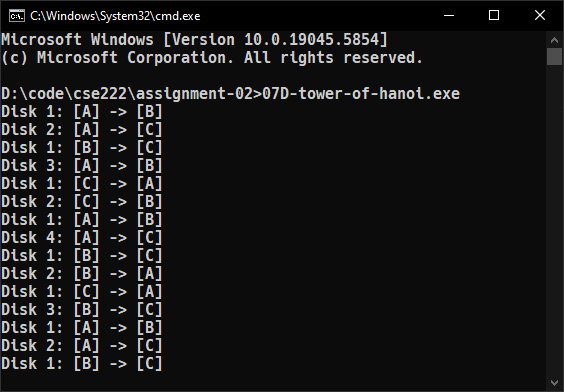

::: {#cover.border}

<section>
	
</section>
<section>
	<p class="h1 w800 underline text-upr">Assignment</p>
	<table class="compact borderless table-large table-upr padless" style="width: 5.1in">
		<tr>
			<th>Course Title</th>
			<th>:</th><td>Data Structure Lab</td>
		</tr>
		<tr>
			<th>Course Code</th>
			<th>:</th><td>CSE 222</td>
		</tr>
		<tr>
			<th>Assignment No.</th>
			<th>:</th><td>02</td>
		</tr>
		<tr>
			<th>Submission Date</th>
			<th>:</th><td>29-05-2025</td>
		</tr>
	</table>
</section>
<section style="--hw: 7.2rem;">
	<p class="h2 w800 text-upr">Submitted To</p>
	<table class="compact borderless table-large table-upr padless withleader">
		<tr>
			<th>Name</th>
			<td>Nasrin Akter</td>
		</tr>
		<tr>
			<th>Dept. of</th>
			<td>Computer Science and Engineering (CSE)</td>
		</tr>
		<tr>
			<th></th>
			<td>Bangladesh University of Business & Technology (BUBT)</td>
		</tr>
	</table>
</section>
<section style="--hw: 7.2rem;">
	<p class="h2 w800 text-upr">Submitted By</p>
	<table class="compact borderless table-large table-upr padless withleader">
		<tr>
			<th>Name</th>
			<td>Shadman Shahriar</td>
		</tr>
		<tr>
			<th>ID No.</th>
			<td>20245103408</td>
		</tr>
		<tr>
			<th>Intake</th>
			<td>53</td>
		</tr>
		<tr>
			<th>Section</th>
			<td>1</td>
		</tr>
		<tr>
			<th>Program</th>
			<td>B.Sc. Engg. in CSE</td>
		</tr>
	</table>
</section>

:::

::: {.centered-heading}

# Data Structure

# Lab Work Assignments

:::

## Linked List

### 1. Implement a singly linked list with the following operations:

-   Insert at the beginning, end and a given position.
-   Delete from the beginning, end and a given position.
-   Display the list.

**Ans.** Here is a C program implementing a singly linked list with the aforementioned operations:

```CPP
/**
 * ======================
 * Name: Shadman Shahriar
 * ID  : 20245103408
 * ======================
 */

#include <stdio.h>
#include <stdlib.h>

struct node
{
	int data;
	struct node *next;
};

struct node *createNode(int data)
{
	struct node *temp = NULL;
	temp = malloc(sizeof(struct node));
	temp->data = data;
}

void display(const char *message, struct node *start)
{
	struct node *temp = start;
	printf(message);
	printf("Head -> ");
	while (temp != NULL)
	{
		printf("[%d] -> ", temp->data);
		temp = temp->next;
	}
	printf("NULL\n");
}

struct node *insertStart(struct node *newNode, struct node *start)
{
	newNode->next = start;
	return newNode;
}

void insertEnd(struct node *newNode, struct node *start)
{
	newNode->next = NULL;
	struct node *temp = start;
	while (temp->next != NULL)
		temp = temp->next;
	temp->next = newNode;
}

void insertAt(struct node *newNode, int position, struct node *start)
{
	struct node *temp = start;
	for (int i = 2; i <= position; i++)
	{
		if (i == position)
		{
			newNode->next = temp->next;
			temp->next = newNode;
		}
		temp = temp->next;
	}
}

struct node *deleteAtStart(struct node *head)
{
	return head->next;
}

void deleteAtEnd(struct node *start)
{
	struct node *temp = start;
	while (temp->next->next != NULL)
		temp = temp->next;
	temp->next = NULL;
}

void deleteAt(int position, struct node *start)
{
	struct node *temp = start;
	for (int i = 2; i <= position; i++)
	{
		if (i == position)
		{
			temp->next = temp->next->next;
		}
		temp = temp->next;
	}
}

int main()
{
	// =====================
	// === initial setup ===
	// =====================
	struct node *head = malloc(sizeof(struct node));
	struct node *one = createNode(2);
	struct node *two = createNode(5);
	struct node *three = createNode(7);

	one->next = two;
	two->next = three;
	three->next = NULL;

	head = one;
	display("Given LinkedList: ", head);

	printf("\nNode Insertion:\n");

	// =================================
	// === add node at the beginning ===
	// =================================
	struct node *four = createNode(6);
	head = insertStart(four, head);
	display("At the beginning: ", head);

	// ===========================
	// === add node at the end ===
	// ===========================
	struct node *five = createNode(9);
	insertEnd(five, head);
	display("At the end      : ", head);

	// =======================================
	// === add node at a specific position ===
	// =======================================
	struct node *six = createNode(4);
	insertAt(six, 2, head);
	display("At position     : ", head);

	printf("\nNode Deletion:\n");

	// ======================================
	// === delete node from the beginning ===
	// ======================================
	head = deleteAtStart(head);
	display("At the beginning: ", head);

	// ================================
	// === delete node from the end ===
	// ================================
	deleteAtEnd(head);
	display("At the end      : ", head);

	// ============================================
	// === delete node from a specific position ===
	// ============================================
	deleteAt(3, head);
	display("At position     : ", head);

	return 0;
}
```

**Output:** The code yields the following output in the terminal:

```bash
Given LinkedList: Head -> [2] -> [5] -> [7] -> NULL

Node Insertion:
At the beginning: Head -> [6] -> [2] -> [5] -> [7] -> NULL
At the end      : Head -> [6] -> [2] -> [5] -> [7] -> [9] -> NULL
At position     : Head -> [6] -> [4] -> [2] -> [5] -> [7] -> [9] -> NULL

Node Deletion:
At the beginning: Head -> [4] -> [2] -> [5] -> [7] -> [9] -> NULL
At the end      : Head -> [4] -> [2] -> [5] -> [7] -> NULL
At position     : Head -> [4] -> [2] -> [7] -> NULL
```



## Stack

### 2. Implement a stack using an array with the following operations:

-   Push
-   Pop
-   Peek
-   Display

**Ans.** Here is a C program that implements a stack using an array:

```C
/**
 * ======================
 * Name: Shadman Shahriar
 * ID  : 20245103408
 * ======================
 */

#include <stdio.h>
#include <stdlib.h>

struct stack
{
	int top, n;
	int *arr;
};

struct stack *createStack(int size)
{
	struct stack *stack = malloc(sizeof(struct stack));
	stack->n = size;
	stack->top = -1;
	stack->arr = malloc(size * sizeof(int));
	printf("Created stack with a capacity of %d\n", size);
	return stack;
}

void deleteStack(struct stack *stack)
{
	free(stack->arr);
	free(stack);
	printf("The stack was deleted\n");
}

int isFull(struct stack *stack)
{
	return stack->top >= stack->n - 1;
}

int isEmpty(struct stack *stack)
{
	return stack->top < 0;
}

int push(struct stack *stack, int x)
{
	if (isFull(stack))
	{
		printf("Overflow\n");
		return 0;
	}
	stack->arr[++stack->top] = x;
	return 1;
}

int pop(struct stack *stack)
{
	if (isEmpty(stack))
	{
		printf("Underflow\n");
		return 0;
	}
	return stack->arr[stack->top--];
}

int peek(struct stack *stack)
{
	if (isEmpty(stack))
	{
		printf("Empty\n");
		return 0;
	}
	return stack->arr[stack->top];
}

void display(struct stack *stack)
{
	int n = stack->top;
	for (int i = 0; i <= n; i++)
	{
		printf("%d", stack->arr[i]);
		if (i != n)
			printf(", ");
	}
}

int main()
{
	struct stack *s = createStack(10);
	push(s, 122);
	push(s, 154);
	push(s, 408);

	printf("Popped element: %d\n", pop(s));
	printf("Top element   : %d\n", peek(s));

	printf("\nCurrent elements in stack:\n");
	display(s);

	printf("\n\b");
	deleteStack(s);
	return 0;
}
```

**Output:** The code yields the following output in the terminal:

```bash
Created stack with a capacity of 10
Popped element: 408
Top element   : 154

Current elements in stack:
122, 154
The stack was deleted
```


## Queue

### 3. Implement a queue using an array with the following operations:

-   Enqueue
-   Dequeue
-   Peek
-   Display

**Ans.** Here is a C implementation of a queue using an array:

```CPP
/**
 * ======================
 * Name: Shadman Shahriar
 * ID  : 20245103408
 * ======================
 */

#include <stdio.h>
#include <stdlib.h>

struct queue
{
	int *arr;
	int front;
	int rear;
	int n;
};

struct queue *createQueue(int n)
{
	struct queue *q = malloc(sizeof(struct queue));
	q->n = n;
	q->front = 0;
	q->rear = -1;
	q->arr = (int *)malloc(n * sizeof(int));
	return q;
}

int isEmpty(struct queue *q)
{
	return q->front > q->rear;
}

void enqueue(struct queue *q, int x)
{
	if (q->rear < q->n - 1)
		q->arr[++q->rear] = x;
}

void dequeue(struct queue *q)
{
	if (!isEmpty(q))
		q->front++;
}

int peek(struct queue *q)
{
	return isEmpty(q) ? -1 : q->arr[q->front];
}

void display(struct queue *q)
{
	for (int i = q->front; i <= q->rear; i++)
		printf("%d ", q->arr[i]);
	printf("\n");
}

int main()
{
	struct queue *q = createQueue(100);
	enqueue(q, 1);
	enqueue(q, 2);
	enqueue(q, 3);

	printf("Front element: %d\n", peek(q));

	dequeue(q);
	enqueue(q, 4);

	printf("Current q: ");
	display(q);
	return 0;
}
```

**Output:** The code yields the following output in the terminal:

```bash
Front element: 1
Current q: 2 3 4
```



## Binary Tree

### 4. Implement a binary tree and insert nodes into the binary tree recursively with the following traversals:

-   In-order
-   Pre-order
-   Post-order

**Ans.** Here is a C++ program that satisfies the given conditions:

```CPP
/**
 * ======================
 * Name: Shadman Shahriar
 * ID  : 20245103408
 * ======================
 */

#include <iostream>
using namespace std;

struct node
{
	int data;
	node *left;
	node *right;

	node(int val)
	{
		data = val;
	}
};

node *createTree()
{
	int x;
	cout << "Enter value (enter -1 to stop): ";
	cin >> x;

	if (x == -1)
		return NULL;

	node *Node = new node(x);
	cout << "Left child of Node " << x << endl;
	Node->left = createTree();

	cout << "Right child of Node " << x << endl;
	Node->right = createTree();

	return Node;
}

void preorder(node *root)
{
	if (root == NULL)
		return;

	cout << root->data << " ";
	preorder(root->left);
	preorder(root->right);
}

void inorder(node *root)
{
	if (root == NULL)
		return;

	inorder(root->left);
	cout << root->data << " ";
	inorder(root->right);
}

void postorder(node *root)
{
	if (root == NULL)
		return;

	postorder(root->left);
	postorder(root->right);
	cout << root->data << " ";
}

int main()
{
	cout << "Root:" << endl;
	node *root = createTree();

	cout << endl;
	cout << "Pre-order Traversal  : ";
	preorder(root);

	cout << endl;
	cout << "In-order Traversal   : ";
	inorder(root);

	cout << endl;
	cout << "Post-order Traversal : ";
	postorder(root);
	return 0;
}
```

**Output:** The code yields the following output in the terminal:

```bash
Root:
Enter value (enter -1 to stop): 154
Left child of Node 154
Enter value (enter -1 to stop): 122
Left child of Node 122
Enter value (enter -1 to stop): 147
Left child of Node 147
Enter value (enter -1 to stop): -1
Right child of Node 147
Enter value (enter -1 to stop): -1
Right child of Node 122
Enter value (enter -1 to stop): 148
Left child of Node 148
Enter value (enter -1 to stop): -1
Right child of Node 148
Enter value (enter -1 to stop): -1
Right child of Node 154
Enter value (enter -1 to stop): 408
Left child of Node 408
Enter value (enter -1 to stop): -1
Right child of Node 408
Enter value (enter -1 to stop): -1

Pre-order Traversal  : 154 122 147 148 408
In-order Traversal   : 147 122 148 154 408
Post-order Traversal : 147 148 122 408 154
```



## Binary Tree

### 5. Count the total number of nodes and leaf nodes in a binary tree.

**Ans.** Here is a C++ program that counts the total number of nodes and leaf nodes in a binary tree using recursion:

```CPP
/**
 * ======================
 * Name: Shadman Shahriar
 * ID  : 20245103408
 * ======================
 */

#include <iostream>
using namespace std;

struct node
{
	int data;
	node *left;
	node *right;

	node(int val)
	{
		data = val;
		left = NULL;
		right = NULL;
	}
};

int countNodes(node *root)
{
	if (root == NULL)
		return 0;

	int l = countNodes(root->left);
	int r = countNodes(root->right);
	return 1 + l + r;
}

int countLeafNodes(node *root)
{

	if (root == NULL)
		return 0;
	if (root->left == NULL && root->right == NULL)
		return 1;
	return countLeafNodes(root->left) + countLeafNodes(root->right);
}

int main()
{
	// binary tree structure:
	//          154
	//        /    \
    //      122   408
	//     /   \
    //   147  148
	node *root = new node(154);
	root->left = new node(122);
	root->right = new node(408);
	root->left->left = new node(147);
	root->left->right = new node(148);

	cout << "Total Nodes: " << countNodes(root) << endl;
	cout << " Leaf Nodes: " << countLeafNodes(root) << endl;
	return 0;
}
```

**Output:** The code yields the following output in the terminal:

```bash
Total Nodes: 5
 Leaf Nodes: 3
```



## Binary Search Tree

### 6. Implement a Binary Search Tree (BST) with In-order Traversal.

**Ans.** Here is a C++ program implementing the Binary Search Tree (BST) with in-order traversal:

```CPP
/**
 * ======================
 * Name: Shadman Shahriar
 * ID  : 20245103408
 * ======================
 */

#include <iostream>
using namespace std;

struct node
{
	int key;
	struct node *left, *right;
};

struct node *newNode(int item)
{
	struct node *temp = (struct node *)malloc(sizeof(struct node));
	temp->key = item;
	temp->left = temp->right = NULL;
	return temp;
}

void inorder(struct node *root)
{
	if (root != NULL)
	{
		inorder(root->left);
		cout << root->key << " ";
		inorder(root->right);
	}
}

struct node *insert(struct node *node, int key)
{
	if (node == NULL)
		return newNode(key);
	if (key < node->key)
		node->left = insert(node->left, key);
	else
		node->right = insert(node->right, key);

	return node;
}

int main()
{
	struct node *root = NULL;
	int x;
	while (x != -1)
	{
		cout << "Enter value (-1 to stop): ";
		cin >> x;
		if (x != -1)
			root = insert(root, x);
	}

	cout << "Inorder traversal:" << endl;
	inorder(root);
	return 0;
}
```

**Output:** The code yields the following output in the terminal:

```bash
Enter value (-1 to stop): 154
Enter value (-1 to stop): 122
Enter value (-1 to stop): 408
Enter value (-1 to stop): 147
Enter value (-1 to stop): 148
Enter value (-1 to stop): -1
Inorder traversal:
122 147 148 154 408
```



## Recursion

### 7A. Write recursive function for factorial of a number.

**Ans.** Here is a C implementation of recursive factorial:

```C
/**
 * ======================
 * Name: Shadman Shahriar
 * ID  : 20245103408
 * ======================
 */

#include <stdio.h>
int factorial(int n)
{
	if (n >= 1)
		return n * factorial(n - 1);
	else
		return 1;
}

int main()
{
	printf("%d", factorial(4));
	return 0;
}
```

**Output:** The code yields the following output in the terminal:

```bash
24
```

### 7B. Write recursive function for the fibonacci series.

**Ans.** Here is a C implementation of recursive fibonacci series:

```C
/**
 * ======================
 * Name: Shadman Shahriar
 * ID  : 20245103408
 * ======================
 */

#include <stdio.h>
int fibonacci(int n)
{
	int fib;
	if (n > 2)
		fib = fibonacci(n - 1) + fibonacci(n - 2);
	else if (n == 2)
		fib = 1;
	else
		fib = 0;
	return fib;
}
int main()
{
	int n = 10;
	for (int i = 1; i <= n + 1; i++)
		printf("%d ", fibonacci(i));
	return 0;
}
```

**Output:** The code yields the following output in the terminal:

```bash
0 1 1 2 3 5 8 13 21 34 55
```

### 7C. Implement Binary Search using recursion.

**Ans.** Here is a C implementation of recursive binary search:

```C
/**
 * ======================
 * Name: Shadman Shahriar
 * ID  : 20245103408
 * ======================
 */

#include <stdio.h>
int binarySearch(int arr[], int left, int right, int key)
{
	if (right >= left)
	{
		int mid = left + (right - left) / 2;

		if (arr[mid] == key)
			return mid;
		if (arr[mid] > key)
			return binarySearch(arr, left, mid - 1, key);
		return binarySearch(arr, mid + 1, right, key);
	}
	return -1;
}

int main(void)
{
	int arr[] = {2, 5, 8, 12, 16, 23, 38, 56, 72, 91};
	int size = sizeof(arr) / sizeof(arr[0]);

	int key = 23;
	int index = binarySearch(arr, 0, size - 1, key);

	if (index == -1)
		printf("NOT Found");
	else
		printf("%d found at index %d", key, index);
	return 0;
}
```

**Output:** The code yields the following output in the terminal:

```bash
23 found at index 5
```



### 7D. Implement Tower of Hanoi using recursion.

**Ans.** Here is a C implementation of the tower of hanoi using recursion:

```C
/**
 * ======================
 * Name: Shadman Shahriar
 * ID  : 20245103408
 * ======================
 */

#include <stdio.h>
void hanoi(int n, char S, char D, char A)
{
	if (n == 0)
		return;

	hanoi(n - 1, S, A, D);
	printf("Disk %d: [%c] -> [%c]\n", n, S, D);
	hanoi(n - 1, A, D, S);
}

int main()
{
	int n = 4;
	hanoi(n, 'A', 'C', 'B');
	return 0;
}
```

**Output:** The code yields the following output in the terminal:

```bash
Disk 1: [A] -> [B]
Disk 2: [A] -> [C]
Disk 1: [B] -> [C]
Disk 3: [A] -> [B]
Disk 1: [C] -> [A]
Disk 2: [C] -> [B]
Disk 1: [A] -> [B]
Disk 4: [A] -> [C]
Disk 1: [B] -> [C]
Disk 2: [B] -> [A]
Disk 1: [C] -> [A]
Disk 3: [B] -> [C]
Disk 1: [A] -> [B]
Disk 2: [A] -> [C]
Disk 1: [B] -> [C]
```


